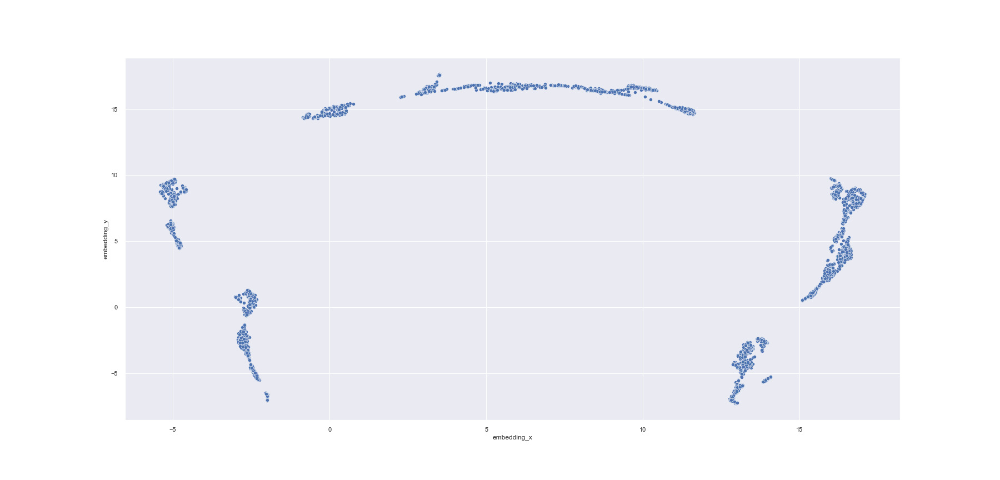
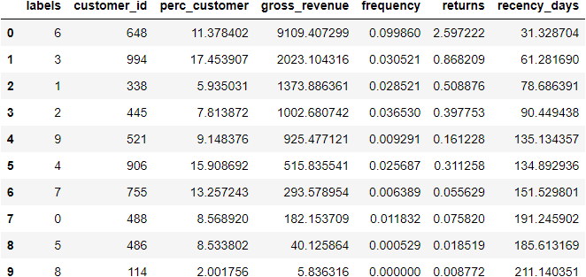
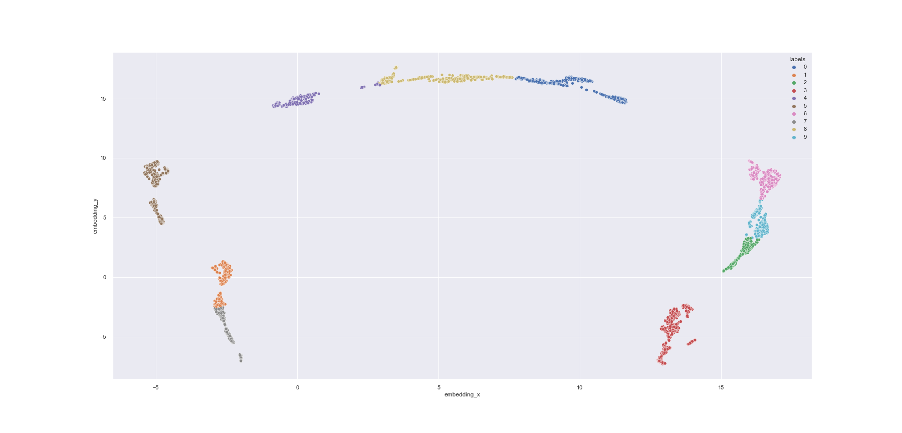
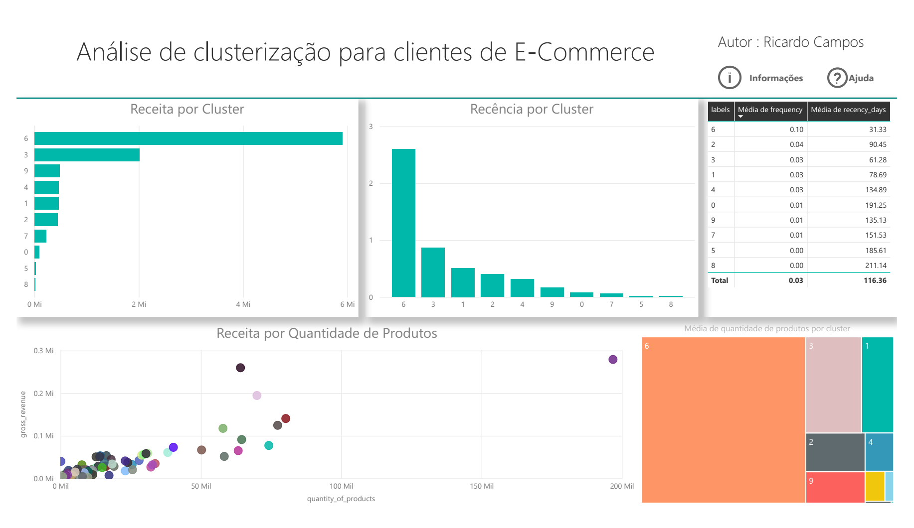

# Clusterização de clientes

 Author : Ricardo Barbosa de Almeida Campos 

## Introdução

Este é um projeto de ciência de dados que tem como objeto criar um modelo de aprendizagem de máquina, que seja capaz de criar clusters em um grupo de clientes de uma empresa de e-commerce, para traçar novas estratégias de vendas.Além de criar uma estrutura online para análise e captação constante dos dados.

## Problema de negócio

A empresa All in One Place é uma empresa Outlet Multimarcas, ou seja, ela comercializa produtos de segunda linha de várias marcas a um preço menor, através de um e-commerce.

Em pouco mais de 1 ano de operação, o time de marketing percebeu que alguns clientes da sua base, compram produtos mais caros, com alta frequência e acabam contribuindo com uma parcela significativa do faturamento da empresa.

Baseado nessa percepção, o time de marketing vai lançar um programa de fidelidade para os melhores clientes da base, chamado Insiders. Mas o time não tem um conhecimento avançado em análise de dados para eleger os participantes do programa.

Por esse motivo, o time de marketing requisitou ao time de dados uma seleção de clientes elegíveis ao programa, usando técnicas avançadas de manipulação de dados.

## Dataset

O dataset utilizado para treinar os modelos e realizar as clusterizações foi retirado da página web do link :<a href = "https://www.kaggle.com/datasets/carrie1/ecommerce-data"> Dataset de transações para lojas de E-commerce</a>

Uma descrição de cada variável presente neste dataset pode ser encontrada na página.

## Desenvolvimento

 O desenvolvimento de estudo seguiu diversos passos que compoem um estudo de clusterização na área de Ciência de Dados. Foram so seguintes passos:
<ul>
  <li> Coleta e Preparação</li>
  <li> Limpeza e Filtragem dos dados</li>
  <li> Feature Engineering </li>
  <li> EDA</li>
  <li> Preparação dos dados</li>
  <li> Seleção de atributos </li>
  <li> Ajuste fino dos hiper parâmetros</li>
  <li> Treinamento do modelo</li>
  <li> Análise dos Clusters </li>
  <li> Visualização do banco de dados</li>
  <li> EDA -  Pós Clusterização</li>
</ul>

 Importante frisar que o prjeto foi divido em duas fases distintas, o desenvolvimento dos modelos de clusterização e análise dos dados. E a fase de produção, na qual o código foi embarcado em uym servidor Ubuntu para execução remota. Na fase de produção três produtos da AWS foram utilizados, o S3, que um repositório de arquivos, o RDS, que um banco de dados e o EC2, no qual é possível a criação de instâncias de servidor.E para que a execução do script acontecesse de forma automática, um arquivo bash foi criado com os comandos necessários para executar o notebook utilizando o pacote papermill. E o arquivo bash foi inserido em um cronjob para execução no mesmo horário de forma automática.

### Coleta e Preparação

 Um problema bastante comum em preparação de dados para plataformas de E-commerce é a inconsistências nas respostas em campos abertos para que o usuário possa inserir dados, seja este usuário funcionário da empresa ou comprados. Duas colunas possuem inconsistência deste tipo, a do país e código do estoque. A do país só necessário somente remover duas linhas nas quais os países estão incorretos. Diferente da colunas de código do estoque, na qual os funcionários da empresa inseriram diversos códigos que não correspondem com produtos, como devoluções. O tratamento desta coluna será explicado mais a frente.

 E para os dados de natureza númerica, inconsistências foram detectadas nas colunas de preços e quantidade. As quantidade negativas foram identificadas como devoluções e os produtos com preço 0, foram identificados como brindes.

### Feature Engineering

 Nesta seção foram criadas algumas variáveis que normalmente são analisadas em problemas de E-commerce. As colunas novas são:
<ul>
  <li> Receita</li>
  <li> Recência </li>
  <li> Número de compras</li>
  <li> Quantidade de produtos comprados</li>
  <li> Tamanho médio da cesta</li>
  <li> Ticket médio </li>
  <li> Média de itens únicos </li>
  <li> Número de retornos </li>
  <li> Frequência de compras </li>
</ul>

Nesta iteração do projeto, os dados faltantes gerados nesta etapa foram deletados porque a quantidade é bem pequena em relação ao total de clientes.

### EDA

A EDA será dividida em duas partes, uma antes da clusterização e uma após a clusterização. Porque o levantamento de hipóteses será realizado em cima dos clusters criados.
Para a primeira parte, uma análise univariável foi realziada com o auxílio do pacote Profiling que gera informação descritivas sobre as colunas de um dataset, como desvio padrão, variância, percentis e outras métricas. Para a análise bivariável, uma série de gráficos par a par entre as colunas do data set foi gerada para que pudesse analisar a dispersão dos dados em relação a outros e se serão formados bons clusters.

 Uma outra etapa importante para a EDA deste projeto, foi a  criação de quatro diferentes espaços de dados para que se pudesse analisar como a dispersão dos dados ficariam nestes espaços novos. A quatro técnicas utilizadas foram o PCA, UMAP, t-SNE e modelos de regressão de árvore. Mais detalhes podem ser analisados dentro do script. O espaço selecionado foi o de árvore, porque apresentou os clusters mais densos e espaçados entre si, como demonstrado na figura abaixo.

### Preparação de dados

 Como todos os dados a serem utilizados para a clusterização foram numéricos, só será realizado o 'rescaling' dos mesmo e não o encoding, que é recomendado para dados categóricos. Como os dados possuem um distribuição bem diferente da normal e um grande número de outliers, foi utilizado o 'min-max-scaler'.

### Seleção de atributos

Para este projeto nenhuma técnica avançada de seleção de dados foi utilizada, somente foram escolhidas as colunas que não se baseam em médias. Porque em um ponto futuro do script, as médias para cada cluster serão realizadas, o que tornaria estas variáveis redundantes.

### Modelos de Aprendizagem de Máquina

 Os modelos de clusterização selecionados como candidatos foram:
<ul>
  <li> K-Means</li>
  <li> Hierarchical Clustering </li>
  <li> DBSCAN</li>
  <li> GMM</li>
</ul>

Não é pertinente deste projeto entrar em detalhes de como cada algoritmo funciona.

Os modelos serão treinados com o espaço de dados gerado pelo espaço gerado pelo Random Forest na etapa de EDA. Os algoritmos foream testado para diferentes números de clusters e para cada combinação o valor da silhoueta do cluster foi salva em uma tabela, para realizar a comparação entre os modelos. A tabela abaixo  será resumida somente para os clusters com as maiores notas.

 Para o algoritmo DBSCAN foi testado 11 clusters e a nota de silhoueta foi de 0,48.

#### Performance dos modelos para diferentes clusters

| Nome do Modelo         |  5      | 6    | 7       | 8    | 9       |
|:----------------------:|:-------:|:----:|:-------:|:----:|:-------:|
| K-Means                | 0,68    | 0,68 | 0,67    | 0,69 | 0,67    |
| Hierarchical Clustering| 0,68    | 0,66 | 0,65    | 0,63 | 0,62    |
| DBSCAN                 | 0,00    | 0,00 | 0,00    | 0,00 | 0,00    |
| GMM                    | 0,68    | 0,67 | 0,65    | 0,62 | 0,61    |

 Para o estágio de produção do projeto, o modelos gerados na fase de análise foram salvos em arquivos no formato pickle e carregados no repositório S3, para serem utilizados de maneira remota, tirando a necessidade de realizar o treinamento do modelo.

### Treinamento do modelo e Análise dos Clusters

O modelo escolhido para a aplicação final foi o KMeans por possuir os melhores resultados. A quantidade de clusters a serem utilizadas no modelo foi de 10, porque será aproximadamente compatível com o modelo RFM para a divisão de estilos de compradores. Para esta quantidade de clusters, a nota de silhoueta foi de 0,68. Os perfis dos clusters foram os seguintes :

A tabela apresentda foi ordenada pela variável gross_revenue, ou receita.

Uma representação gráfica de como ficaram os clusters pode ser vista na imagem abaixo.

### Visualização dos resultados

Adcionar uma plataforma para visualização dos resutlados da clusterização é importante, porque os dados que estarão dentro do banco de dados serão constantemente atualizados e para evitar que novos relatório em notebook sejam gerados. A plataforma escolhida em questão foi o Microsoft Power BI, por ser uma ferramenta amplamente adotada no mercado.

### EDA - Pós Clusterização

Nesta seção serão apresentadas respostas as perguntas realizadas pelo time de negócio que puderam ser respondidas após a clusterização dos dados. As perguntas e as respostas foram as seguintes:
<ul>
  <li> Quem são os clientes elegíveis para participar do programa de insiders ?</li>
  <ul>
    <li> 12583, 14688, 15311,  16029, 12341, ..</li>
  </ul>
  <li> Quantos clientes farão parte do grupo ?</li>
  <ul>
    <li> 648 clientes </li>
  </ul>
  <li> Quais as principais características desses clientes ? </li>
  <ul>
        <li> Número de clientes: 648</li>
        <li> Gasto médio: R$ 9109.41 </li>
        <li> Recência média: 31 dias</li>
        <li> Quantidade média de devolução: 3</li>

  </ul>
  <li> Qual a porcentagem de contribuição do faturamento, vinda do Insiders ?</li>
  <ul>
    <li> 4,67% </li>
  </ul>
</ul>

Outras perguntas também foram realizadas, mas as mesmas não pertencem a esta etapa do projeto.

## Próximos Passos

  
 Para os próximos passos deste proejto seria interessante refinar ainda mais os modelos de clusterização e realizar algum tipo de modelo de série temporal para poder prever o quanto será por clusters e traçar uma estratégia de marketing em cima desta informação.
  

